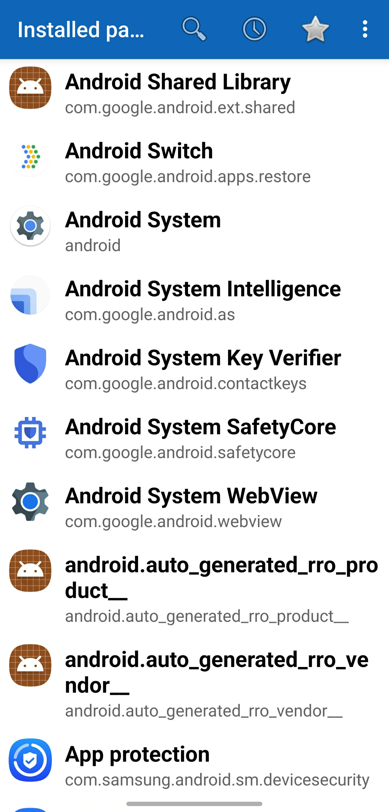
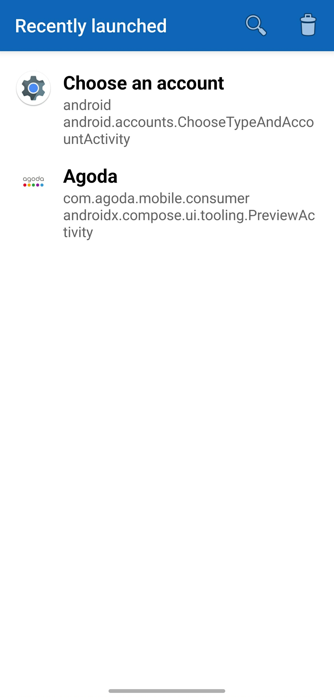
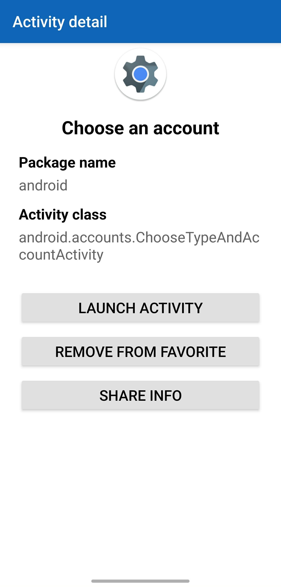
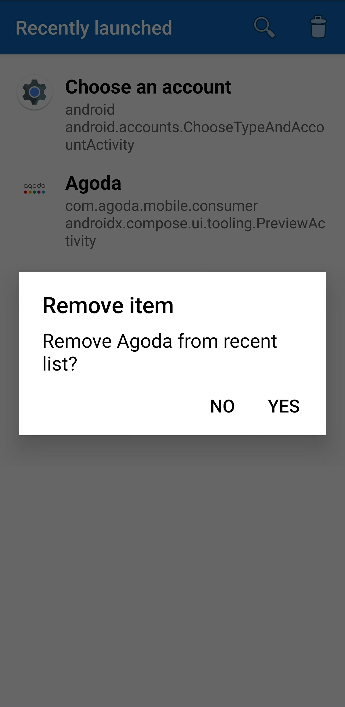
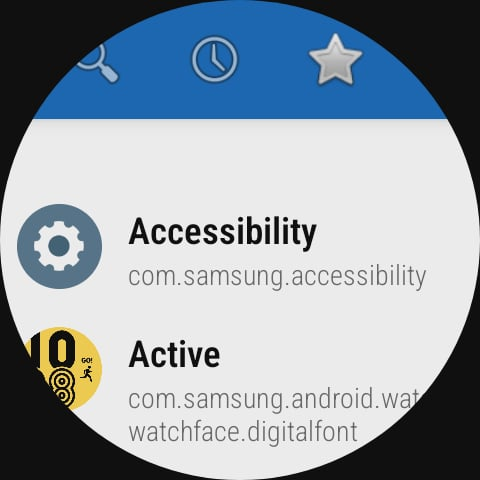
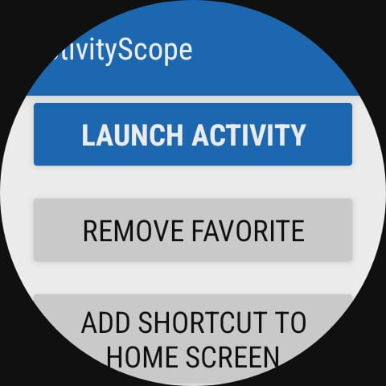
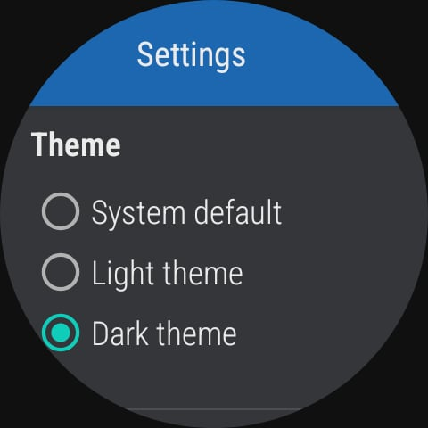

# ActivityScope

ActivityScope is an Android utility app for browsing, searching, and launching exported activities from installed applications.

It is inspired by the open source project **ActivityLauncher** and adds extra functions such as favorites, recent history, theming, and better behavior on small screens and watches.

---

## Table of Contents

- [Features](#features)
- [Screenshots](#screenshots)
- [Installation](#installation)
  - [Install the APK](#install-the-apk)
  - [Build From Source](#build-from-source)
- [Usage](#usage)
  - [Installed Packages](#installed-packages)
  - [Activities List](#activities-list)
  - [Activity Detail](#activity-detail)
  - [Recent](#recent)
  - [Favorites](#favorites)
  - [Settings](#settings)
- [Project Background](#project-background)
- [Acknowledgements](#acknowledgements)
- [License](#license)

---

## Features

### Installed Packages

* Lists all installed applications on the device
* Includes system apps when possible
* Tap an app to view its exported activities

### Activity Browser

* Shows exported activities for the selected package
* Tap an activity to launch it directly
* Long press an activity to add or remove it from favorites

### Activity Detail Screen

* Launch the activity
* Toggle "Favorite" status
* **New in 1.1.0:** Create a shortcut for the activity directly on your home screen

### Favorites

* Dedicated **Favorites** tab for frequently used activities
* **New in 1.1.0:** Long press an item to enter multi-select mode, allowing you to delete multiple items at once
* Toolbar action to clear the entire list or delete selected items

### Recent Activity History

* Automatically tracks activities launched through ActivityScope
* **Recently launched** tab for quick access
* **New in 1.1.0:** Long press an item to enter multi-select mode to delete specific entries
* Toolbar action to clear the entire history or delete selected items

### Search

* Search bar available on all main screens (Installed, Recent, Favorites)
* Instantly filters the list as you type

### Theme Support

* System default theme
* Light theme
* Dark theme
* Alert dialogs and detail screens are styled so that text stays readable in both day and night modes

### Small Screen and Wear Friendly Layouts

* Detail screen uses a scrollable layout
* Works on round smartwatch displays where vertical space is limited
* Icon and label are visible when the screen opens, and the rest of the content can be scrolled

---

## Screenshots

The first row shows the phone UI, and the second row shows the same features running on Wear OS (tested on Wear OS 6.0 / Android 16, with full functionality available).

| Phone – installed packages | Phone – recently launched | Phone – activity detail | Phone – remove recent dialog |
| --- | --- | --- | --- |
|  |  |  |  |

| Watch – installed packages (Wear OS 6.0) | Watch – activity detail header (Wear OS 6.0) | Watch – activity actions (Wear OS 6.0) | Watch – settings with theme options (Wear OS 6.0) |
| --- | --- | --- | --- |
|  |  |  |  |

---

## Installation

### Install the APK

1.  Download the latest `.apk` file (e.g., `ActivityScope-v1.1.0.apk`) from the **Releases** page of this repository.
2.  Copy the APK file to your Android device.
3.  Enable installation from unknown sources if required by the device.
4.  Open the APK on the device and install ActivityScope.

### Build From Source

1.  Clone this repository:

        git clone https://github.com/henryshuen/ActivityScope.git
        cd ActivityScope

2.  Open the project in **Android Studio**.
3.  Let Gradle sync and make sure the project builds successfully.
4.  Build a release APK. You can use one of these methods:

    * In the Gradle tool window run:

            app > Tasks > build > assembleRelease

        The signed APK will be located at:

            app/build/outputs/apk/release/app-release.apk

    * Or use the menu entry **Build → Generate Signed App Bundle / APK…**
        and follow the signing wizard with your release keystore.

---

## Usage

### Installed Packages

* Default screen when ActivityScope starts
* Displays installed packages on the device
* Tap a package to open its activity list

### Activities List

* Shows exported activities of the selected application
* Tap to launch an activity
* Long press to toggle the favorite state of an activity

### Activity Detail

* Shows the full package name and class name of an activity
* Provides three main actions: **Launch Activity**, **Toggle Favorite**, and **Add Shortcut to Home Screen**

### Recent

* Contains activities recently launched from ActivityScope
* Long press an item to enter multi-select mode, allowing you to delete multiple entries at once
* Use the toolbar action **Clear recent** to remove all items or only the selected items

### Favorites

* Displays activities marked as favorites
* Long press an item to enter multi-select mode to remove specific favorites
* Use the toolbar action to remove all items or only the selected items

### Settings

The settings screen contains:

* **Theme**
    * System default
    * Light theme
    * Dark theme
* **About**
    * Author information
    * Credit to the original ActivityLauncher project
    * Link to the original repository
    * Note that a large part of the implementation was created with the help of ChatGPT 5.1 and then adjusted and integrated by the human author

---

## Project Background

ActivityScope started as a personal tool to extend and modernize the ideas from the ActivityLauncher project.

Motivation included:

* Easier browsing of activities for each app
* A convenient favorites system
* A recent history list for quick recall
* Better layouts on watches and compact screens
* Cleaner dark and light theme handling

A significant portion of code and refactoring work was assisted by **ChatGPT 5.1**, while the author focused on design decisions, testing, and polishing.

---

## Acknowledgements

* Original inspiration: **ActivityLauncher**
    Repository: <https://github.com/butzist/ActivityLauncher>
* Development assistance: **ChatGPT 5.1**, used for code generation, refactoring, and debugging support.

---

## License

This project is released under the **MIT License**.

See the `LICENSE` file for the full license text.
